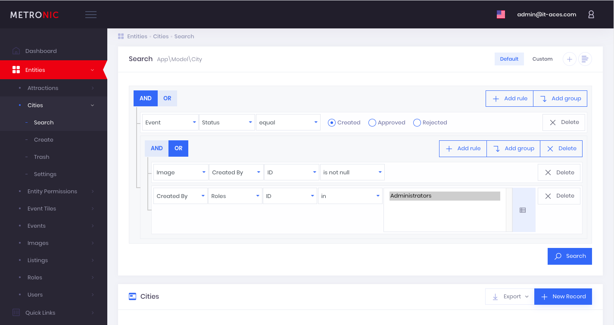

# Example integration with Admin Panel developed by [IT Aces](https://vvk.com/) team

## Dependencies

 * [laravel](https://github.com/laravel)
 * [laravel/passport](https://github.com/laravel/passport)
 * [laravel/ui](https://github.com/laravel/ui)
 * [laravel-doctrine/orm](https://github.com/laravel-doctrine/orm)
 * [vvk/laravel-doctrine](https://github.com/vvk-kolsky/laravel-doctrine)
 * [vvk/laravel-doctrine-acl](https://github.com/vvk-kolsky/laravel-doctrine-acl)
 * [vvk/laravel-doctrine-web](https://github.com/vvk-kolsky/laravel-doctrine-web)
 * [vvk/laravel-doctrine-admin](https://github.com/vvk-kolsky/laravel-doctrine-admin)

## Install

 * Checkout

```BASH
git clone git@github.com:vvk-kolsky/laravel-doctrine-example.git
```

 * Add repositories to composer.json

```BASH
"repositories": [
	{
       "type": "vcs",
       "url": "git@github.com:vvk-kolsky/laravel-doctrine.git"
    },
    {
       "type": "vcs",
       "url": "git@github.com:vvk-kolsky/laravel-doctrine-acl.git"
    },
    {
       "type": "vcs",
       "url": "git@github.com:vvk-kolsky/laravel-doctrine-web.git"
    },
    {
       "type": "vcs",
       "url": "git@github.com:vvk-kolsky/laravel-doctrine-admin.git"
    },
    {
       "type": "vcs",
       "url": "git@github.com:vvk-kolsky/laravel-doctrine-oauth.git"
    },
    {
       "type": "vcs",
       "url": "git@github.com:vvk-kolsky/laravel-doctrine-example.git"
    }
]
```

 * Install packages

```BASH
composer install
```

```BASH
npm install
```

## Setting up

 * Compiling assets

```BASH
npm run dev
```

 * Validating ORM. The result must contains _[Mapping]  OK - The mapping files are correct._ end error _[Database] FAIL - The database schema is not in sync with the current mapping file._

```BASH
php artisan doctrine:schema:validate

Validating for default entity manager...
[Mapping]  OK - The mapping files are correct.
[Database] FAIL - The database schema is not in sync with the current mapping file.
```

 * Synchronizing DB.

```BASH
php artisan doctrine:schema:update
 
Checking if database connected to default entity manager needs updating...
Updating database schema...
Database schema updated successfully! "53" queries were executed
```

 * Creation of roles and administrator with login _admin@vvk.com_ and password _doctrine_

```BASH
php artisan db:seed --class="VVK\Database\Seeds\RoleTableSeeder"
Database seeding completed successfully.

php artisan db:seed --class="VVK\Database\Seeds\UserTableSeeder"
Database seeding completed successfully.
```

 * Set up your DB connection, APP_URL and add the following lines to .env
 
```PHP
FILESYSTEM_DRIVER=public

DOCTRINE_PROXY_AUTOGENERATE=1
DOCTRINE_CACHE=file
DOCTRINE_RESULT_CACHE=array
DOCTRINE_SECOND_CACHE_TTL=3600
DOCTRINE_RESULT_CACHE_TTL=120
```

## Testing

 * Fill the database
 
```BASH
php artisan storage:link
mkdir storage/app/public/images
php artisan db:seed
```

 * Go to the admin panel and set full permissions for the role with the code "visitor"
 
 

 * Running tests
 
 ```BASH
 php artisan test
 ```
 
## Next

To create an application from scratch or add an admin panel to an existing project, you do not need this package. Please install separately:

 * [vvk/laravel-doctrine](https://github.com/vvk-kolsky/laravel-doctrine)
 * [vvk/laravel-doctrine-acl](https://github.com/vvk-kolsky/laravel-doctrine-acl)
 * [vvk/laravel-doctrine-web](https://github.com/vvk-kolsky/laravel-doctrine-web)
 * [vvk/laravel-doctrine-admin](https://github.com/vvk-kolsky/laravel-doctrine-admin)
 
