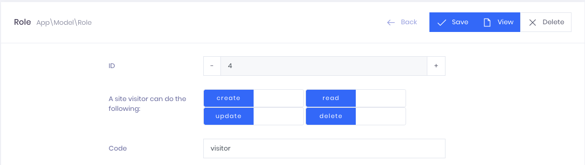

# Example integration with Admin Panel developed by [IT Aces](https://it-aces.com/) team



## Dependencies

 * [laravel](https://github.com/laravel)
 * [laravel/passport](https://github.com/laravel/passport)
 * [laravel/ui](https://github.com/laravel/ui)
 * [laravel-doctrine/orm](https://github.com/laravel-doctrine/orm)
 * [it-aces/laravel-doctrine](https://bitbucket.org/vitaliy_kovalenko/laravel-doctrine/src/master/)
 * [it-aces/laravel-doctrine-acl](https://bitbucket.org/vitaliy_kovalenko/laravel-doctrine-acl/src/master/)
 * [it-aces/laravel-doctrine-web](https://bitbucket.org/vitaliy_kovalenko/laravel-doctrine-web/src/master/)
 * [it-aces/laravel-doctrine-admin](https://bitbucket.org/vitaliy_kovalenko/laravel-doctrine-admin/src/master/)

## Install

 * Create Laravel project

```BASH
laravel new laravel-doctrine-example
```

 * Add repositories to composer.json

```BASH
"repositories": [
	{
       "type": "vcs",
       "url": "git@bitbucket.org:vitaliy_kovalenko/laravel-doctrine.git"
    },
    {
       "type": "vcs",
       "url": "git@bitbucket.org:vitaliy_kovalenko/laravel-doctrine-acl.git"
    },
    {
       "type": "vcs",
       "url": "git@bitbucket.org:vitaliy_kovalenko/laravel-doctrine-web.git"
    },
    {
       "type": "vcs",
       "url": "git@bitbucket.org:vitaliy_kovalenko/laravel-doctrine-admin.git"
    },
    {
       "type": "vcs",
       "url": "git@bitbucket.org:vitaliy_kovalenko/laravel-doctrine-example.git"
    }
]
```

 * Install packages

```BASH
composer require it-aces/laravel-doctrine-example
```

```BASH
npm install cross-env css-loader jquery popper.js bootstrap
```

## Setting up

 * Compiling assets

```BASH
npm run dev
```

 * Validating ORM. The result must contains _[Mapping]  OK - The mapping files are correct._ end error _[Database] FAIL - The database schema is not in sync with the current mapping file._

```BASH
php artisan doctrine:schema:validate

Validating for default entity manager...
[Mapping]  OK - The mapping files are correct.
[Database] FAIL - The database schema is not in sync with the current mapping file.
```

 * Synchronizing DB.

```BASH
php artisan doctrine:schema:update
 
Checking if database connected to default entity manager needs updating...
Updating database schema...
Database schema updated successfully! "11" query was executed
```

 * Creation of roles and administrator with login _admin@it-aces.com_ and password _doctrine_

```BASH
php artisan db:seed --class="ItAces\Database\Seeds\RoleTableSeeder"
Database seeding completed successfully.

php artisan db:seed --class="ItAces\Database\Seeds\UserTableSeeder"
Database seeding completed successfully.
```

 * .env
 
```PHP
FILESYSTEM_DRIVER=public
```

## Testing

 * Fill the database
 
```BASH
php artisan storage:link
php artisan db:seed
```

 * Running tests
 
 ```BASH
 php artisan test
 ```
 

